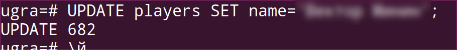
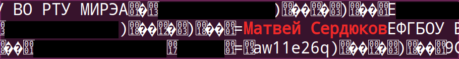

# Удалённая база данных

25 мая в 16:42 югорского времени мы узнали об ошибке в регистрационных данных одной из команд. За неимением иного интерфейса (админки), мы отправились исправлять данную ошибку в интерактивную консоль базы данных PostgreSQL.

Сначала пользователь базы данных выяснил идентификатор пользователя, данные которого нужно заменить, запросом `SELECT * FROM players WHERE name LIKE '%[REDACTED]%';`. После этого произошло следующее:

В качестве оперативной меры реагирования база была выключена вместе со всей системой регистрации, а также была сделана резервная копия. Отметим, что это было первой резервной копией за все три года существования этого сервера.

Выяснилось, что PostgreSQL использует технологию *MVCC (Multiversion Concurrency Control)* — с помощью версионирования решаются проблемы с конкурентным доступом к данным. В результате работы этой технологии в резервной копии остались имена участников, что подтвердилось командой `grep` с флагом `-a`:

Далее мы провели около 6 часов в попытках восстановить имена участников соревнований. Было выяснено, что технология TOAST, применяемая в PostgreSQL, приводит к тому, что строки хранятся отдельно от записей и могут не иметь ни длины в начале, ни маркера конца.

Более сотни пользователей удалось восстановить, просто попытавшись спарсить структуру данных строки после восьми байт, равных ID участника — в некоторых случаях удавалось найти длину строки (в специфичном формате `varlena` — например, значение длины `0x39` означает, что строка будет иметь длину 27 байт, хотя казалось бы, что всё наоборот — `0x27 = 39`), а за ней и само имя.

Более того, размер поля с длиной строки (!) задаётся младшим битом первого байта этого самого поля — единица означает, что поле однобайтовое, и саму длину в нём задают 7 бит, а ноль — что поле четырёхбайтовое. Но значащих битов в нём не 31, как можно было бы подумать, а 30 — ещё один ноль тоже следует игнорировать.

Ещё вдвое число восстановленных пользователей увеличилось, когда мы начали проверять не только структуры, начинающиеся с такого формата длины, но и произвольные строки символов — оказалось, что перед частью из них вместо длины находятся байты `EF BF BD` — их предназначение остаётся загадкой.

Остальных пользователей мы восстанавливали, используя их образовательную организацию и идентификатор сертификата — в дампе они нередко шли рядом друг с другом и с искомым именем участника. При этом, как ни странно, ID участника рядом с ними не находилось.

Таким образом, у нас остался всего лишь один участник, данные которого мы не смогли восстановить. Их на самом деле нет ни в одном месте всего полученного дампа.

### Мораль

1. Делайте бекапы.
2. Не пишите запросы напрямую в консоль.
   * Делайте админки.
   * Или не делайте, но тогда удачи :)
3. Проверяйте запросы перед тем, как писать точку с запятой.
