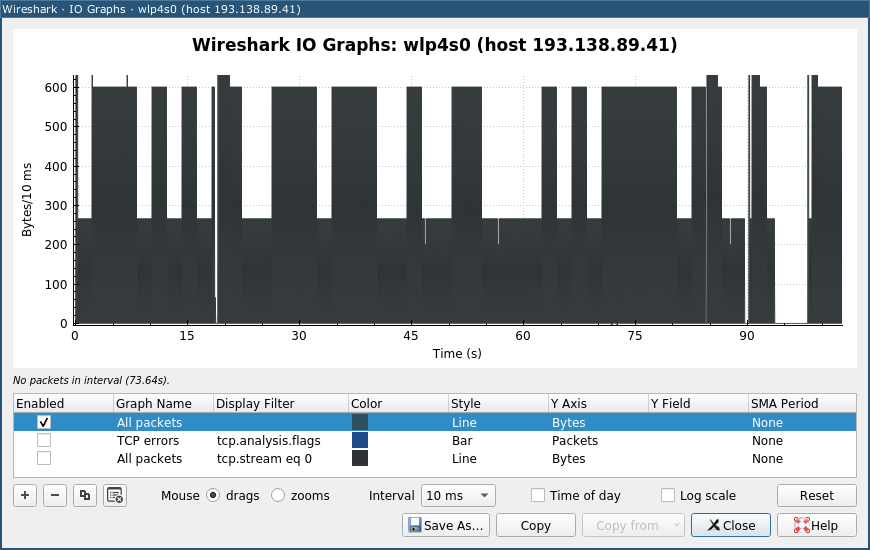

# Без единиц: Write-up

Как и положено файлу блочного устройства /dev/zero, ссылка позволяла скачать бесконечное количество нулевых байт. В заголовках никакой полезной информации не было. В нулевых байтах её не было тем более. Сменяться чем-нибудь более значительным они не собирались, даже попытка скачать файл не сначала, передавая заголовок `Range`, говорила об этом:

```
$ curl https://devzero.q.2020.ugractf.ru/e4df6ac07d750a71/dev/zero -H 'Range: 10000000000-20000000000'
HTTP/1.1 416 Да какая разница, всё равно там одни нули
```

Файл скачивался невыносимо медленно. Если точнее, скорость загрузки была то 5 килобайт в секунду, то 1 килобайт в секунду, а через несколько минут стабилизировалась на 2.5 килобайтах в секунду. Если пытаться скачать файл несколько раз, колебания скорости в точности повторялись для каждой попытки.

Можно изучить эту закономерность, например, при помощи Wireshark. Откроем его, сразу поставим фильтр `host devzero.q.2020.ugractf.ru`, чтобы не хранить лишние данные, включим запись трафика и поставим файл скачиваться до тех пор, пока скорость загрузки не стабилизируется (это происходит примерно через 13 минут).

Не дожидаясь конца загрузки, построим график скорости скачивания: _Statistics_ → _I/O Graph_. Благодаря тому, что таск работает на отдельном IP-адресе, дополнительная фильтрация не потребуется (иначе можно было бы задать фильтр в колонке _Display filter_ в том же синтаксисе, что и обычные фильтры Wireshark). Выбираем _Bytes_ в колонке _Y Axis_ — и сразу чётко видим два уровня скорости. Это — биты флага: единице соответствует быстрая скорость скачивания, нулю — медленная; длительность одного бита составляет 2 секунды.

Особенно чёткими уровни становятся, если установить _Interval_ равным _10 ms_ и мышью подобрать масштаб графика:



Короткие всплески вызваны нестабильностью сети и в целом не мешают отличить уровни.

Выписываем биты флага и преобразуем их в байты, например, [Кибершефом](https://gchq.github.io/CyberChef/#recipe=From_Binary%28%27Space%27%29). Если получилось, что какие-то периоды нестабильности в сети продлились больше 2 секунд, и утраченные биты не удаётся подобрать из контекста, можно повторить скачивание и восстановить проблемные места по данным второй попытки.

Флаг: **ugra_did_you_ever_feel_that_clean_099b0353112e**.

## Постмортем

Изначально таск был запущен на том же сервере, что и все остальные, и трафик на него подавался через nginx. Различные буферизации в nginx приводили к тому, что вместо постепенного скачивания с заданной скоростью файл скачивался редкими рывками по 4, 8 или 16 килобайт, и распознать флаг становилось невозможно. Проблема была замечена при проверке через несколько часов после начала соревнования; полностью отключить все буферизации в nginx, сделав таск решаемым, не удалось, поэтому пришлось унести его на отдельный сервер, чтобы участники подключались к нему напрямую.
