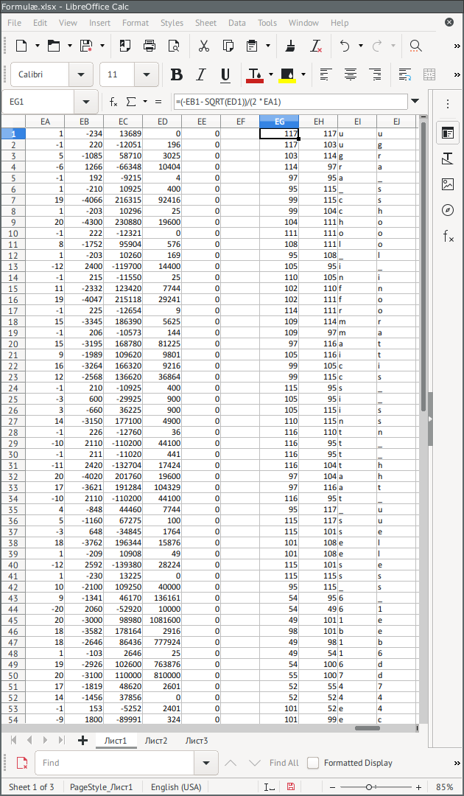

# Формулы: Write-up

Для начала изучим файл. Есть столбик из букв, под ним — ячейка «неправильно». На листе 2 — аналогичная конструкция, только букв меньше, они другие, и ячейка говорит «правильно». Можем заметить, что если поменять любой символ, то значение превращается в «неправильно».

В ячейке «правильно/неправильно» есть формула, которая говорит, что произведение ячеек диапазона EE1:EE54 равно 1. В этом диапазоне столбца EE видим много ячеек с нулями, каждая из которых содержит формулу такого вида:

```
=IF(AND(AND(EE44=1, 15*(CODE(A19)^2) - 3195*CODE(A19) + 168780 = 0), 15*(CODE(A20)^2) - 3195*CODE(A20) + 168780 = 0), 1, 0)
```

Из этого можно сделать следующие выводы: 

* Ячейка принимает значение 0 или 1. Соответственно, нужное произведение становится равным 1 только при равенстве 1 всех ячеек диапазона.
* Каждая ячейка проверяет равенство 1 какой-то другой ячейки, за исключением одной, которая вместо этого проверяет истинность условия `2 + 2 = 4` (очевидно, истинного всегда). Если добиться, что в этой особой ячейке будет 1, то удастся добиться того же и для той ячейки, на которую она ссылается. В свою очередь, это разблокирует возможность сделать значение 1 в следующей ячейке по цепочке, и так далее. Если все остальные условия во всех ячейках будут выполнены, все они станут равными 1. Чтобы почувствовать, как это работает, можно пробовать по одной портить буквы на листе 2 и наблюдать, как превращаются в нули целые каскады единиц.
* Коды символов из ячеек столбца A (текущей и предыдущей строки) должны удовлетворять _квадратному уравнению_ (в данном примере такому: 15x² − 3195x + 168780 = 0). Уравнение повторено два раза.

Поработаем с этими уравнениями. Чтобы получить решения, нужно выписать коэффициенты, посчитать по формуле дискриминант, после чего также по формуле вычислить два корня. Запишем для первого уравнения коэффициенты _a_, _b_, _c_ в столбцы EA, EB, EC; в столбце ED посчитаем дискриминант: `=EB1 ^ 2 - 4 * EA1 * EC1`. В столбцах EG и EH выпишем формулы корней: `=(-EB1 - SQRT(ED1)) / (2 * EA1)` и `=(-EB1 + SQRT(ED1)) / (2 * EA1)` (в русской версии функция `SQRT` называется `КОРЕНЬ`). Убедимся, что мы получили два положительных числа. Поскольку уравнению должны удовлетворять коды символов, получим из кода сами символы в столбцах EI и EJ: `=CHAR(EG1)` и `=CHAR(EH1)` (в русской версии функция `CHAR` называется `СИМВОЛ`).

Осталось внести в столбцы коэффициенты уравнений. Можно сделать это вручную ещё 53 раза, это не очень долго. Если хочется автоматизировать процесс, то можно заменить в ячейках символ `=` на что-нибудь другое, скопировать текст в текстовый редактор и аккуратно удалять повторяющиеся участки так, чтобы остались только числа.

Распространим формулы в столбцах ED и EG–EJ. Если мы нигде не ошиблись, дискриминанты везде будут квадратами целых неотрицательных чисел, а корни — кодами букв.



Осталось воссоздать файл, выбрав в каждой строке одну букву из двух возможных. Сожмём столбцы B–DZ и будем вписывать ответ сразу в столбец A. С первыми символами всё понятно — это начало флага `ugra_`. Приведём дальнейшие рассуждения на примере строки 6. Символ из ячейки A6 должен удовлетворять сразу двум квадратным уравнениям: из ячейки EE6 и из ячейки EE7. Общий корень у этих уравнений только один — число 115 (буква `s`). Аналогично в ячейке A7 оказывается буква `c`, в A8 — буква `h` и так далее. Неоднозначность возникает только в строках 29 и 38, а также в строке 54 в силу её расположения: там условию будет удовлетворять любая из двух букв. Первые две неоднозначности можно разрешить по смыслу слов английского языка; варианты, порождённые неоднозначностями в случайной части флага, можно было попробовать сдать все.

Важно заметить, что в силу этих неоднозначностей появление ячейки «правильно» не являлось гарантией того, что буквы, написанные над ней, образуют флаг.

Флаг: **ugra_school_informatics_isnt_that_useless_61eb16d744ec**.

## Постмортем

Изначальная версия генератора порождала файлы, которые открывались в LibreOffice Calc, но не открывались в Microsoft Excel — он считал некорректными все формулы. Дело было в том, что логические условия были записаны с использованием синтаксиса `=Условие1 AND Условие2` вместо `=AND(Условие1, Условие2)`, а Microsoft Excel поддерживает только последний.

При разработке задания совместимость получающихся файлов с Microsoft Excel не была проверена. Когда проблема выяснилась после обращений участников, генератор был исправлен. Однако у проверяющей системы была особенность: перегенерация задания приводила к генерации нового флага. Перегенерировать задания для всех команд было невозможно, поскольку некоторые команды могли уже потратить значительные усилия на решение задания в LibreOffice Calc, и после перегенерации им пришлось бы всё переделывать с начала. Поэтому перегенерация проводилась только по запросу от команд.

В репозитории находится исправленная версия генератора.
