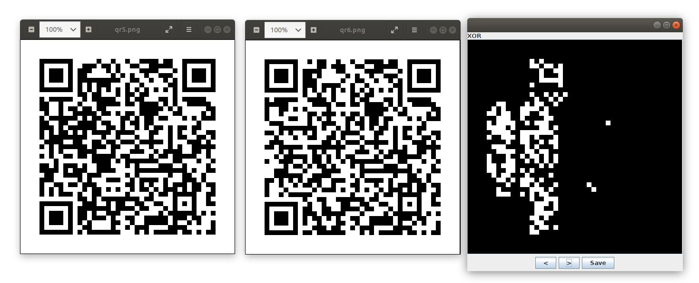

# Друзья: Write-up

Перед нами очередной сайт, напоминающий социальную сеть. Внутри видим несколько пользователей и личные страницы. С пользователями можно дружить, отношение дружбы похоже на обычную социальную сеть (нужно, чтобы оба человека добавили друг друга в друзья), всё как обычно.

Авторизация же устроена немного нестандартно. Для регистрации нужен только логин, при его вводе нас отправляют на страницу пользователя. Нам предлагается отсканировать QR-код приложением для генерации одноразовых паролей, которые запрашиваются при каждой попытке ввода. Никакой другой защиты нет — только этот ненастраиваемый одноразовый пароль.

Зайдя несколько раз в свой аккаунт, можно обратить внимание на то, что предлагаемый QR-код не меняется. Именно в нём закодирован *секретный ключ* — специальное значение, на основе которого генерируются одноразовые пароли. Таким образом, если этот ключ утечёт, то сбросить или сменить его будет уже невозможно, и доступ к нашему аккаунту сможет получить любой желающий.

Не менее интересно и другое наблюдение. Зарегистрируем двух пользователей с коротких интервалом (так, чтобы они получили соседние идентификаторы) и сравним их QR-коды. Это можно сделать с помощью утилиты Stegsolve в режиме `XOR`.



Видим, что большая часть QR-кодов идентична. Отличается только левая часть — та, в которой находится область коррекции ошибок. Она используется, чтобы код мог считываться корректно даже без части пикселей. Это наводит на мысль, что и содержимое кодов может быть похоже. Давайте декодируем:

```
otpauth://totp/friends:user1?secret=OVZWK4S7NFSD2MBQGAYDAMBQGAYDAMBV&issuer=friends
otpauth://totp/friends:user2?secret=OVZWK4S7NFSD2MBQGAYDAMBQGAYDAMBW&issuer=friends
```

Действительно, отличается лишь логин и небольшая часть секрета — только последний символ. Можно заметить, а можно [прочитать в спецификации](https://github.com/google/google-authenticator/wiki/Key-Uri-Format#secret), что `secret` — это base32-закодированные строки без символов `=` на конце.

Декодируя base32, получаем совершенно неожиданный результат:

```
user_id=000000000005
user_id=000000000006
```

Что ж, это означает, что никакого секрета эти коды не представляют. Давайте попробуем авторизоваться как администратор. Из списка пользователей мы можем узнать, что у него логин `admin` и ID 1. Соответственно, его секрет будет равен `user_id=000000000001` или `OVZWK4S7NFSD2MBQGAYDAMBQGAYDAMBR` после кодирования в Base32.

Зная секрет, получаем общую ссылку для приложения — `otpauth://totp/friends:admin?secret=OVZWK4S7NFSD2MBQGAYDAMBQGAYDAMBR&issuer=friends`. Генерируем QR-код любым удобным способом и сканируем его с помощью приложения для генерации паролей.

> Некоторые приложения (например, Authy) вместо QR-кода принимают и сам секрет в виде текстовой строки.

Заходим на главную страницу и авторизуемся с пользователем `admin` и свежим одноразовым паролем. В его профиле и видим уведомление с флагом.

Флаг: **ugra_oh_no_totp_secret_leaked_9e506824561e**.
