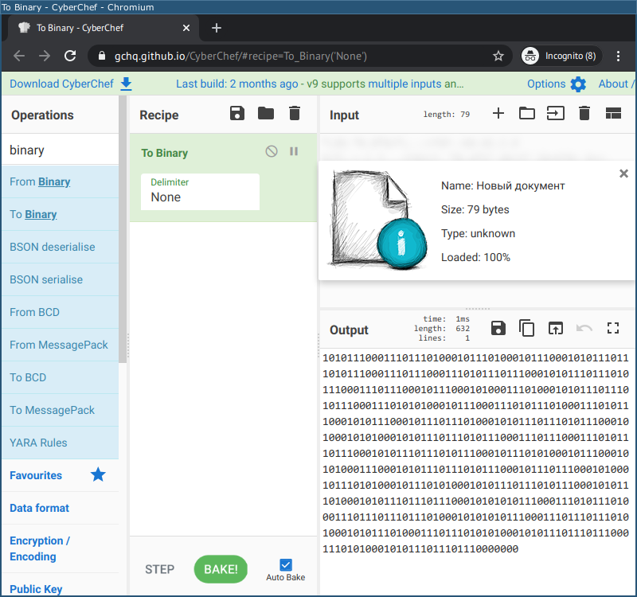
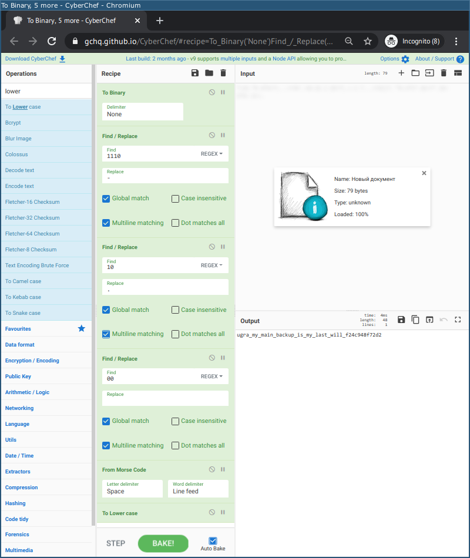

# Дед файл сделал: Write-up

Дед, похоже, застал те времена, когда размер _машинного байта_ мог быть различным на разных платформах, например, 6 или 7 бит, поэтому решил не заморачиваться с этими мелочами и закодировать информацию последовательностью бит. Представим информацию в двоичном виде, например, [Кибершефом](https://gchq.github.io/CyberChef/#recipe=To_Binary%28%27None%27%29).

Видим, что чередуются блоки нулей и единиц, причём, за исключением нулей в конце файла, каждая цифра или идёт одна, или повторяется трижды. Это строго соответствует [спецификации международной азбуки Морзе](https://en.wikipedia.org/wiki/Morse_code#Representation,_timing,_and_speed): точка кодируется единичным сигналом, тире — сигналом тройной длительности, длительность паузы между сигналами одной буквы равна длине точки, длительность паузы между буквами — длине тире.

Добавим в Кибершефе замены — `1110` → `-`; `10` → `.`; `00` → ` ` — и он сам предложит декодировать азбуку Морзе.

Вот [итоговый рецепт](https://gchq.github.io/CyberChef/#recipe=To_Binary%28%27None%27%29Find_/_Replace%28%7B%27option%27:%27Regex%27,%27string%27:%271110%27%7D,%27-%27,true,false,true,false%29Find_/_Replace%28%7B%27option%27:%27Regex%27,%27string%27:%2710%27%7D,%27.%27,true,false,true,false%29Find_/_Replace%28%7B%27option%27:%27Regex%27,%27string%27:%2700%27%7D,%27%20%27,true,false,true,false%29From_Morse_Code%28%27Space%27,%27Line%20feed%27%29To_Lower_case%28%29).

Флаг: **ugra_my_main_backup_is_my_last_will_f24c948f72d2**
