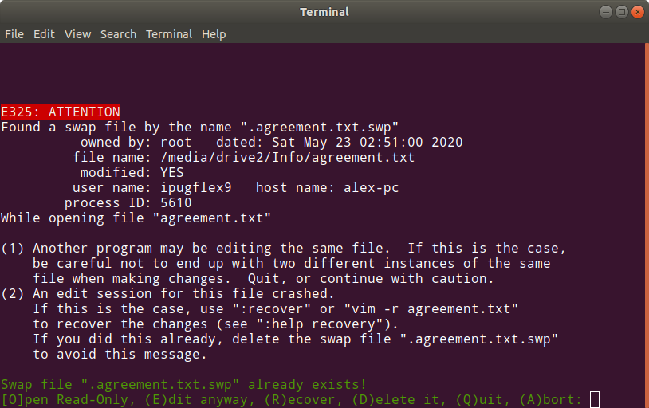

# Хай-тек II: Write-up

Ключевой идеей данного таска было то, что `.swp`-файлы хранят в себе не только автоматически сохранённое содержимое файла, но и некоторые его метаданные. В частности, к ним относятся дата изменения, данные о хостнейме, на котором производилось редактирование и информация о владельце файла.

При восстановлении с ключом `-r` Vim не показывает эту информацию, однако, если просто попытаться открыть несуществующий файл в этой директории, то нас предупредят о возможном конфликте и на этот раз Vim покажет детали:

На нём мы видим необычное имя пользователя — `ipugflex9`. Попробуем найти его где-нибудь ещё. Для этого воспользуемся любым сервисом, который позволяет искать пользователей по именам. Например, namechk.com. Он выдаёт несколько недоступных аккаунтов, а также публичный аккаунт в твиттере. В твиттере мы находим его работы. Одна из них — конференция для дошкольников «Ползти в Ай-Ти». На странице этого мероприятия мы и находим флаг от второй части.

Флаг: **ugra_we_all_make_good_websites_a876ec4b2df5**
