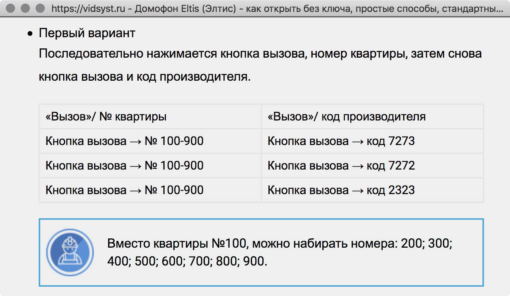

# Домофон: Write-up

Видим постмодернистский домофон. Инстинктивно идём искать коды в интернете:



Пробуем некоторые варинаты и понимаем, что домофон открывется по одной из двух комбинаций:
```
В200 В2323
В200 В7232
```

Попадаем на в̴͓̂е̶̳̌ч̵̢̀е̸̗̎р̵͕͘и̵̙͐н̷̮̿к̷̼͝у̸̫͝.

Флаг: **ugra_pati_na_hate_4c7a348a63fd**.
