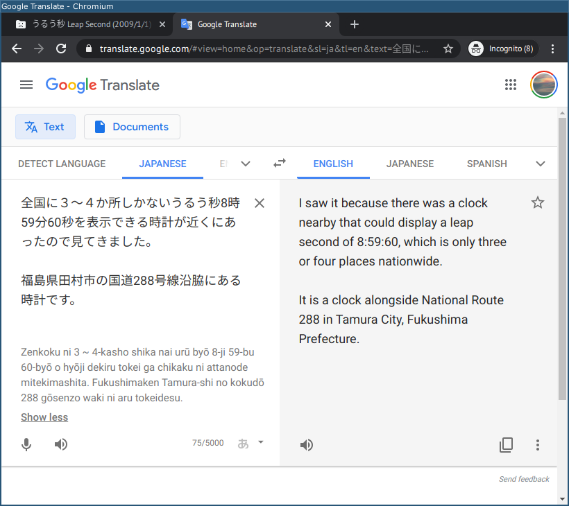
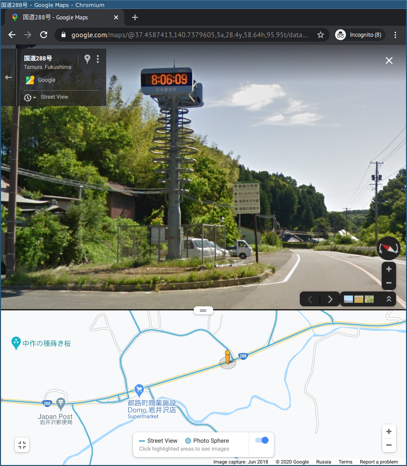
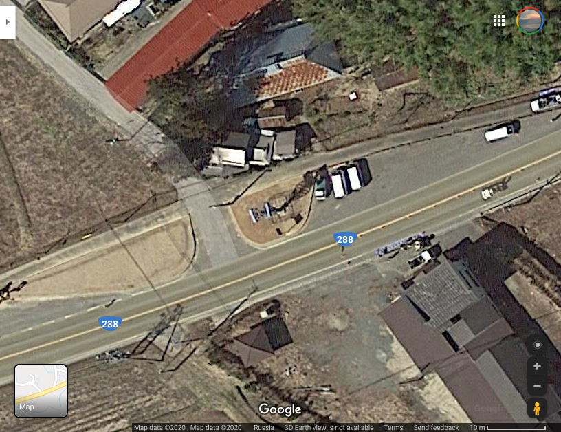

# Праздник в Японии: Write-up

Нас встречает страница на японском языке с [видео](https://www.youtube.com/watch?v=PJ4TWChcKpI): на нём показаны часы, корректно отображающие _високосную секунду_, случившуюся 1 января 2009.

> Високосная секунда может быть назначена решением Международной службы вращения Земли и систем отсчёта (IERS) 30 июня или 31 декабря в 23:59:60 UTC — это 08:59:60 следующего дня по часовому поясу Японии. Благодаря этой поправке восход Солнца случается в одно и то же время (отсчитываемое атомными часами) в условиях нерегулярно замедляющегося вращения Земли. С введения этого стандарта в 1972 до написания этого текста в середине 2020 високосная секунда объявлялась 27 раз, последний из них был 31 декабря 2016. С программной поддержкой високосных секунд имеются большие проблемы — например, время Unix полностью игнорирует их существование — что порой приводит к разного рода проблемам. В тех применениях, где это критично, рекомендуется использовать TAI — шкалу времени, ориентирующуюся только на атомные часы и имеющую ровно 86400 секунд в каждых сутках. По состоянию на середину 2020 TAI и UTC различаются на 37 секунд.

Переведём страницу, например, [онлайн-переводчиком Гугла](https://translate.google.com/).

> Мы переводим на английский язык, а не на русский, потому что, судя по артефактам перевода, для пары японский–русский Гугл делает перевод в два этапа: сначала с японского на английский, потом с английского на русский. Такой подход, скорее всего, будет использоваться для любой непопулярной пары языков. На каждом этапе двойного перевода могут появляться неточности, которые могут оказаться критичными для понимания деталей текста. Иногда лучше пострадать над текстом на английском, переводя в крайнем случае отдельно непонятные слова или части предложений, чем пытаться отгадывать странности в тексте на родном и понятном, казалось бы, русском.

Понимаем, что надо разыскать эти часы и ввести в форму их координаты. 

В описании видео на Ютубе есть текст на японском. Переведём его:

Итак, часы стоят у дороги национального значения 288 города Тамура префектуры Фукусима. Если пользоваться только этой информацией, в поисках координат пришлось бы прочесать на панорамах примерно 40 километров пути. Перебрать не получится: форма не позволяет делать запросы слишком часто. Попробуем поискать ещё.

Поиск по картинкам по запросу [[tamura clock](https://www.google.com/search?q=tamura+clock&tbm=isch)] забит винтажными электромеханическими часами — они, конечно, красивые, но к нашим часам отношения не имеют. Попробуем поискать на языке оригинала. Выясним с помощью переводчика и уточним с помощью Википедии, что «город Тамура» — это 田村市, а «часы» — 時計. Поиск по картинкам по запросу [[田村市時計](https://www.google.com/search?q=田村市時計&tbm=isch)] приводит на [страницу на Foursquare](https://foursquare.com/v/%E7%94%B0%E6%9D%91%E5%B8%82%E9%83%BD%E8%B7%AF%E9%9B%BB%E6%B3%A2%E6%99%82%E8%A8%88%E5%A1%94/557fa66b498e859df0f530d7) — она указывает на место на дороге 288. Смотрим окрестности этого места на панорамах и в 200 метрах на восток обнаруживаем часы.

Целимся в основание часов на спутниковой карте правой кнопкой. Пункт _What’s here?_ даёт нам координаты: 37.458878, 140.738184.

Теперь надо ввести их в форму. Поля, судя по переводу, предназначены для ввода координат, однако с единицами измерения переводчик явно не справился. Придётся разбираться самим. Заметим, что поля первой строки начинаются с 北緯の, а поля второй — с 東経の. Переведя отдельно эти части, понимаем, что верхняя строка — это северная широта, а нижняя — восточная долгота. Если отбросить повторяющиеся части, в обеих строках останется останется одно и то же: у первого поля — 度, у второго — 分, у третьего — 秒, у четвёртого — センチ秒. Переведя эти слова, выясним, что это градусы, минуты, секунды и _сантисекунды_ (то есть сотые доли секунды).

Если поискать [37.458878, 140.738184] в картах Гугла, он покажет градусы, минуты, секунды и _десятые_ доли: _37° 27′ 32.0″ N, 140° 44′ 17.5″ E_. К десятым долям можно было дописать ноль и получить из них сотые; эти координаты менее точные, чем десятичные до шестого знака после запятой, но погрешность в таком случае не превысила бы заветные 5 метров. Либо можно было воспользоваться [каким-нибудь онлайн-конвертером форматов меры угла](https://www.rapidtables.com/convert/number/degrees-to-degrees-minutes-seconds.html) и получить результат с точностью до сотых: _37° 27′ 31.96″ N, 140° 44′ 17.46″ E_.

При попытке ввести эти символы просто так возникнет プレゼンテーションエラー — presentation error (переводчики переводили это на русский как _ошибка презентации_. хотя точнее был бы перевод _ошибка представления_). Всё дело в том, что форма требует — и предупреждает об этом открытым текстом — использовать исключительно полноширинные цифры (full-width numbers). Поискав в интернете это странное понятие, выясняем, что у цифр, латинских букв и прочих символов из первой половины ASCII есть полноширинные формы. Находим [преобразователь](https://en.calc-site.com/letters/convert_full_half), вводим туда наши числа и получаем запись полноширинными цифрами: ３７, ２７, ３１, ９６; １４０, ４４, １７, ４６.

> В эпоху до Юникода каждая письменность имела свою кодировку или даже несколько. Языкам с алфавитной письменностью, таким как русский или, скажем, армянский, хватало однобайтной кодировки, даже оставалось место под разные красивые символы, но японскому этого никак не хватало — требовалось минимум два байта. Кроме того, на текстовых терминалах обычные буквы имели высоту примерно вдвое больше, чем ширину, а японские символы по своей естественной форме квадратные. Это совпадение привело к тому, что ширину символа (1 или 2 знакоместа) и количество занимаемых им байт (1 или 2 байта) приравняли. Для совместимости, возможности работать терминалам, не поддерживающим одновременно символы разной ширины, и сохранения вертикального выравнивания в кодировку добавили полноширинные версии основных символов ASCII; также в них осталось место под множество неалфавитных спецсимволов — давних прообразов современных эмодзи — а также под русские и греческие буквы. Именно по этой причине на некоторых японских и китайских товарах и вывесках русские буквы выглядят именно так: разделённые большим расстоянием и обрезанные снизу, а на самом деле — просто механически вписанные в квадрат при разработке шрифта.

Но и это ещё не всё. Введя, наконец, верные координаты в верном формате, мы попадаем на страницу, которая говорит, что точка достаточно близка к необходимой, и за это мы награждаемся флагом. Однако дальше идёт непонятная строка, которая хоть и начинается со слова _Югра_, на флаг вовсе не похожа: ユグラ・アルバイト・トランプ・パソコン・一八零七四零零八五零九二.

Проще всего с участком после последней точки: это всего лишь цифры от 0 до 9, и нужно перевести их по одной. С префиксом `ugra_` тоже всё понятно. Оставшиеся же три слова могут быть переведены совершенно по-разному, их примерные значения — «подработка», «козырь» и «компьютер».

Вместо неоднозначного перевода следовало применить более простой подход, дающий однозначный результат — транслитерацию. Переводчик Гугла показывает под оригиналом транслитерацию нужных нам слов: _arubaito_, _toranpu_, _pasokon_.

> Знаки японской письменности подразделяются на _кандзи_ (сложные иероглифы, в основном заимствованные из китайского, которыми записывается большинство слов) и _каны_ (слоговые азбуки: каждый знак обозначает один из 48 возможных слогов; знаки _хираганы_ используют для суффиксов и служебных частей речи вроде уже знакомой нам частицы принадлежности の, _катаканой_ же записывают иностранные имена и заимствованные слова). Знаки, обозначающие цифры, относятся к кандзи. Транслитерированные нами слова записаны катаканой: アルバイト (arubaito) произошло от немецкого _Arbeit_ (работа); トランプ (toranpu) — от английского _trump_ (козырь); パソコン (pasokon) — первые слоги произнесённых на японский манер слов _personal computer_. Одни и те же символы кандзи могут читаться по-разному в зависимости от контекста, степени формальности, предпочтений автора и читающего и кучи других факторов, символы же каны читаются всегда однозначно.

Осталось собрать флаг из полученных кусочков.

Флаг: **ugra_arubaito_toranpu_pasokon_180740085092**.
