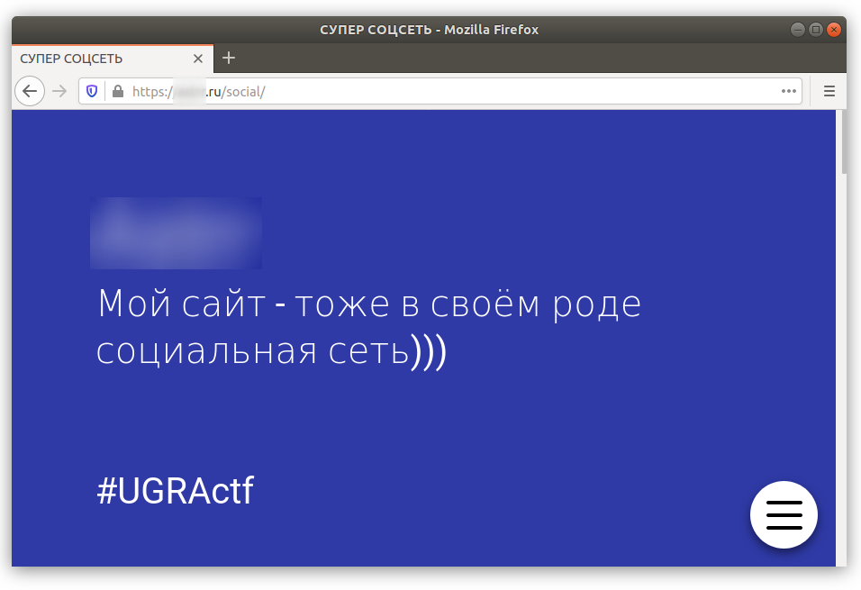
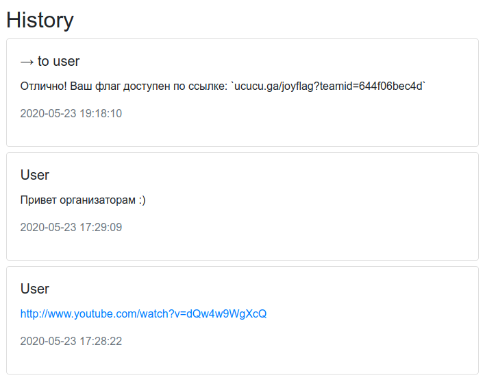

# Самый важный таск: Write-up

Казалось бы, в этом таске не может быть ничего интересного. Однако не все участники смогли сделать то, что было описано в условии таска. Например, один из участников сделал свою социальную сеть и прислал на неё ссылку.

Другой участник подошёл к таску достаточно оригинально, отправив вместо фотографии [видеоролик](https://www.youtube.com/watch?v=dQw4w9WgXcQ). Разработчики подошли к ответу не менее оригинально, отправив вместо флага [другую ссылку](https://ucucu.ga/joyflag?teamid=644f06bec4d):

К слову, на другом конце провода был достаточно приятный веб-интерфейс, с помощью которого мы получали ваши сообщения и отвечали на них.

Флаг: **ugra_thanks_for_good_photo_e17911d206cb**
