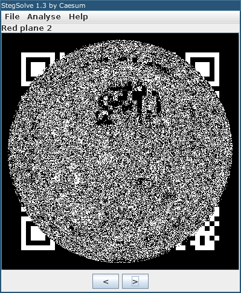
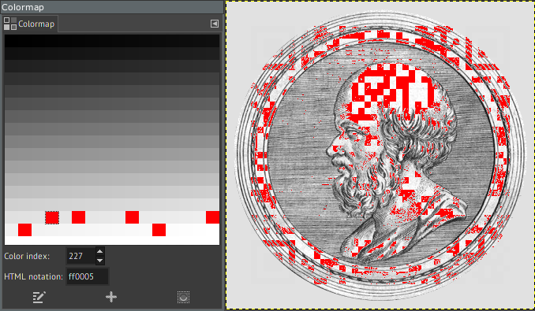
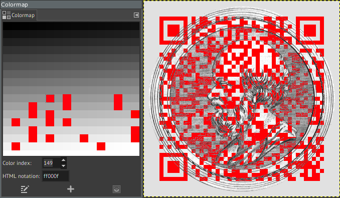

# Святая простота: Write-up

На картинке изображён Эратосфен (это можно понять, загрузив картинку в поиск Гугла или Яндекса). В задании несколько раз говорится о простоте, а один из самых известных алгоритмов поиска простых чисел приписывается именно ему (он называется «решето Эратосфена»).

Полистаем битовые каналы утилитой stegsolve. Начиная с некоторого канала, видим по углам что-то, похожее на углы QR-кода; ещё на одном канале замечаем срединный участок этого же QR-кода на макушке Эратосфена. Восстановить весь QR-код таким образом, впрочем, не удаётся.

Откроем картинку в графическом редакторе, таком как GIMP. Заголовок окна говорит о том, что режим цветности изображения — индексированный, иными словами, цвета на изображении задаются палитрой; в ней в данном случае 256 цветов. Саму палитру можно смотреть и редактировать (_Windows_ → _Dockable dialogs_ → _Colormap_).

Нажмём на выбор цвета под набором инструментов, выберем в появившемся окне пипетку и поводим по изображению в тех областях, где мы что-то обнаружили. Пикселям QR-кода соответствуют такие значения яркости, как 223, 239, 241, 251. Все эти числа объединяет то, что они простые — это позволяет предположить, что QR-код образуется именно теми пикселями, яркость которых является простым числом.

Осталось их выделить. В том же окне _Colormap_ можно выбрать цвет по номеру (_Color index_) и отредактировать (нажав на цвет либо введя какое-нибудь уникальное значение _HTML notation_). Найдём [список первых простых чисел](https://oeis.org/A000040) и будем идти с конца. 

Перекрашивать все до одного цвета необязательно: весь QR-код станет чётко виден уже через 15–20 цветов. Добытый таким образом QR-код можно распознать любым удобным способом.

Вот так можно повысить шансы успешного распознавания: выкрутим контраст и яркость (меню _Colors_ → _Brightness–Contrast_) и применим последовательно фильтры _Dilate_ и _Erode_ (из меню _Filters_ → _Generic_).

Флаг: **ugra_no_firewood_required_for_now_e684b810bef5**.
