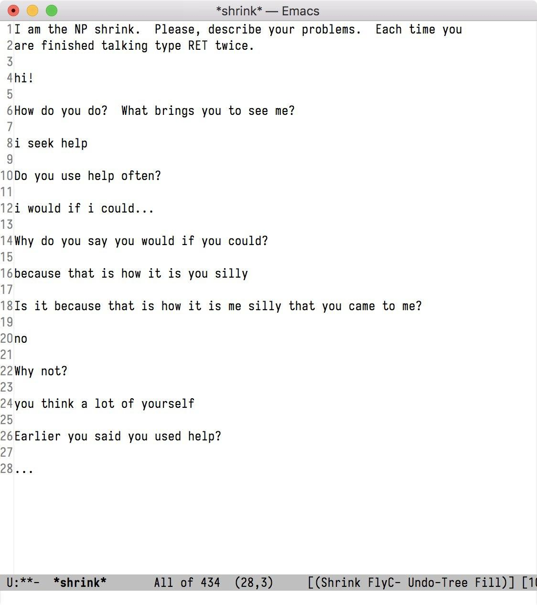

# Расширение сознания: Write-up

Файл `shrink.el` — это программа, написанная на диалекте языке программирования Lisp для текстового редактора Emacs. Понять это можно, во-первых, по расширению `.el`, во-вторых по характерным функциям вроде `(interactive)`.

Устанавить Emacs легко, понять, как им пользоваться — чуть сложнее. В целом, Emacs больше похож на обычные текстовые редакторы, чем на какой-нибудь эзотерический vi: можно печатать буквы и перемещаться по тексту стрелочками. От всего его отличает лишь возможность делать трюки с помощью разных странных сочетаний клавиш вроде `C-x C-b`.

Знать нужно три вещи:

1. `C` — это Ctrl, `M` — Alt или Escape, `RET` — Enter. 
2. Запись `C-x C-f` означает «с зажатым Ctrl нажать _x_, затем нажать _f_».
3. Из любой ситуации можно выйти сочетанием `C-g` или `ESC ESC ESC`. Из самого редактора — `C-x C-c`.

Запустим программу: откроем новый файл с помощью `C-x C-f <путь до shrink.el> RET`, после чего скажем `M-x eval-buffer RET`. (Последняя команда пройдётся по открытому файлу, последовательно выполнив (evaluate) все выражения в нём, что пригодится нам чуть позже.) Мы действительно увидим приглашение программы-психотерапевта:



С ним можно поговорить на любые темы и заметить, что на некоторые слова, связанные с CTF-соревнованиями он реагирует чуть иначе. Убедивишсь, что ничего интересного на первый взгляд в программе не происходит, можно приступить к изучению кода. Для этого крайне удобно будет воспользоваться всё тем же редактором. Начнём с того, что вернёмся к буферу программы: `C-x ←`.

> Lisp — язык, знаменитый своим простым синтаксисом: программы на этом языке состоят из `(списков разных данных)`, которые последовательно выполняются по следующему правилу: первый элемент — это функция, остальные — её аргументы. Например, арифметические действия выполняются вот так: `(+ (/ 10 5) 2)` (получится 4).

При беглом чтении можно заметить несколько странных моментов. Первый — страшная, непонятная и недокументированная функция `shrink-ai`, которая занимает больше ста строк и содержит начало флага:
```elisp
(defun shrink-ai
    (i) "What even is this thing... We only know that it is alive."
    (let ((y (list (seq-take (cddddr (cddddr (cddddr (cdddr (cddr (cddddr (cddddr i))))))) (1+ (1+ (1+ (1+ (1+ (length nil))))))))))
      (string-prefix "ugra" (apply
                             (car
                              (cdr
                               (cdr
                                (cdr
                                 (cdr
                                  (cdr
                                   (cdr
                                    (cdr
                                     (cdr
                                      (cdr
                                       (cdr
                                        (cdr
                                        [...]
```

Второй — объявление некоторой переменной `static`, которая часто передаётся функции `shrink-ai`, выглядящей ровно так, как выглядит программирование в кошмарных снах:
```elisp
(defvar static '(
                 // here we defіne our pascal program:
                 \documentclass[a4papaer]{letter}
                 \usepackage{cl-mapcar}[margins=1mm,2mm,1000mm]
                 begin promgram1;
                 \#include <iostream>
                 \#ifndef PLATFORM_LISP_MACHINE
                 \#define SHRINK concat
                 \#endif

                 program hello;
                 begin;
                 integerp secure-hash = "sha256"; \\ sanity check
                 secure_hash->dominant = RAW_BYTES of bytearray(100) to string;
                 const luxor = () => SELECT (field, entity) from unity_3d_character_map;

                 while luxor ==== professional_c_programming do as follows:
                     sort(luxor, fun, ORDER: ascending)
                     @app.get("/")
                     def (return 0):
                         print(multibyte-array) to string

                 \\ frankly speaking, this algorithm needs some optimization
                 float Q_rsqrt( float number){
                         long i;
                         float x2, y;
                         const float threehalfs = 1.5F;
                         
                         x2 = number * 0.5F;
                         y  = number;
                         i  = * ( long * ) &y;
                         i  = 0x5f3759df - ( i >> 1);
                         y  = * ( float * ) &i;
                         y  = y * ( threehalfs - ( x2 * y * y));   // 1st iteration
                         return y;
                 }                 
                 \\ we can apply it to any float as we usually do in C:
                 ++++++++[>+>++>+++>++++>+++++>++++++>+++++++>++++++++>+++++++++>++++++++++>+++++++++++>++++++++++++>+++++++++++++>++++++++++++++>+++++++++++++++>++++++++++++++++<<<<<<<<<<<<<<<<-]>>>>>>>>>>>>>>----.++++<<<<<<<<<<<<<<>>>>>>>>>>>>>>-.+
                 \\ it does not work for integers (such as 65 6 68 85 62 66 88 69 19 94 8 61 71 90 80 108 69 13 71 11 13 14 105 82 1 89 81 11 13 86 6 82 4 83 81 and so on)
                 area({triangle, A, B, C}) ->
                     S = (A + B + C)/2, math:sqrt(S*(S-A)*(S-B)*(S-C));

                 a = Q_rsqrt(area(input)) :: Maybe Something -> Definitely Something
                 a x = do n <- console.log x
                 System.out.println x.toString
                 a ugra = Nothing

                 return Прервать(КонецДня(Рабочего));
                 ))
```

Что же этой функции такого? И при чём тут переменная? Давайте составим хотя бы примерное представление.

Тело начинается начинается с функции `(let VARIABLES BODY)` — это стандартный способ задавать локальные переменные: всё, что определено внутри `VARIABLES`, будет доступно внутри `BODY`. Разбираться с переменными сейчас особо нет смысла. Давайте дальше. Вызывается функция `string-prefix`, потом идёт нечитаемый мрак. Зато есть хоть какая-то зацепка. Посмотрим, что делает функция `string-prefix`, поставив курсор на её название и нажав `M-.`:

```elisp
(defun string-prefix (pref str)
  "Determine whether PREF is a prefix of STR."
  (and (string-prefix-p pref str) str))
```

Не нужно быть экспертом, чтобы понять, что вызов `(string-prefix "ugra" НЕЧИТАЕМЫЙ-МРАК)`, а следовательно, и вся функция `shrink-ai` вернёт строку, начинающуюся с `ugra` (флаг?!) либо ничего. То есть внутри нечитаемого мрака происходит какая-то криптография и пришло время доставать отладчик — благо, он тут есть. Допишем в определении функции `shrink-ai` вызвов функции `debug` в самом начале, чтобы получилось так:
```elisp
(defun shrink-ai
    (i) "What even is this thing... We only know that it is alive."
    (debug)
    (let ((y (list (seq-take (cddddr (cddddr (cddddr (cdddr (cddr (cddddr (cddddr i))))))) (1+ (1+ (1+ (1+ (1+ (length nil))))))))))
```

Заново выполним программу: `M-x eval-buffer RET`. В какой-то момент всплывёт окно отладчика, в котором с помощью клавиш _d_ и _c_ можно шагать вглубь функций и и пропускать скучные моменты. Аккуратно поигравшись с кодом и освоившись с управлением, можно прийти к таким выводам:

1. Функция заимствует данные для работы из определённых позиций внутри переменной `static`
2. Звучат слова _logxor_ и _sha256_
3. В деле замешана ещё одна переменная, `we`

С помощью поиска по файлу (`C-s`) можно понять, что `we` — некий счётчик, который начинается с ноля и увеличивается на единицу каждый раз, когда мы затрагиваем тему CTF и флагов. Поскольку *никакому нормальному человеку* не захочется разбираться в нечитаемом мраке, вполне естественно желание прекратить анализ при первой же возможности и начать тупой перебор. Исполним же это желание, написав простенький цикл: 
```elisp
(while (not (shrink-ai static))
       (setq we (+ we 1)))
```

Поместим курсор в конец внешнего выражения и скажем `M-x eval-last-sexp`. Emacs не завис намертво — а, значит, мы оказались правы, и при определённом значении переменной `we` злосчастная функция действительно перестаёт возвращать nil. Что же она возвращает теперь? Выполним её, поместив курсор теперь уже в конец выражения `(shrink-ai static)`. Там флаг. 

Флаг: **ugra_shrunk_the_shrink_18a284eb06b2**.

---

### Бонус: погружаемся в нечитаемый мрак

Раскукожить генерацию флага в стандартном отладчике практически нереально: количество вложенных вызовов достигает просто неприличного количества. Можно воспользоваться другим грязным трюком: определить переменные `i` (аргумент функции) и `y` (объявляется внутри `let`) глобально:
```emacs-lisp
(setq i static)
(setq y (list (seq-take (cddddr (cddddr (cddddr (cdddr (cddr (cddddr (cddddr i))))))) (1+ (1+ (1+ (1+ (1+ (length nil)))))))))
```

Затем с помощью `M-x eval-last-sexp` можно пройтись по выраженям внутри тела функции, выписывая результаты на бумажку и надеясь их осмыслить.

Получится что-то такое:
``` emacs-lisp
(defun shrink-ai
    (i) "What even is this thing... We only know that it is alive."
    (let (y '(integerp secure-hash = "sha256" secure_hash->dominant)))
    (string-prefix "ugra" 
      (apply 'string 
             (apply 'cl-mapcar
                    (list
                     'logxor
                     (seq-filter 'integerp '(such as 65 6 8 [...]))
                      ; теперь нетрудно понять, откуда берётся шифротекст
                     (apply 'secure-hash (list 'sha256
                                               (apply 'string
                                                      (list we))))))))
```

Эту функцию можно упростить, воспользовавшись определением `apply` и избавивишь от теперь излишнего `let`:
``` emacs-lisp
(defun shrink-ai
    (i) "What even is this thing... We only know that it is alive."
    (string-prefix "ugra" 
      (apply 'string 
             (cl-mapcar 'logxor
                 (seq-filter 'integerp '(such as 65 6 8 [...]))
                      ; теперь нетрудно понять, откуда берётся шифротекст
                 (secure-hash 'sha256 (string we))))))
```

Воспользовавшись справкой по функцияя (`C-h f`) или интернетом, наконец приходит понимание, которое для пущего понимания я приведу на языке Python:
```python
import hashlib

def shrink_ai(i):
    hashed_var = hashlib.sha256(
        chr(i).encode()
    ).hexdigest() # sha256-хеш символа с номером как значение аргумента
    flag = ""
    for a, b in zip(flag, hased):
        flag += str(ord(a) ^ ord(b)) # простой XOR
    return flag

```

Вот.
